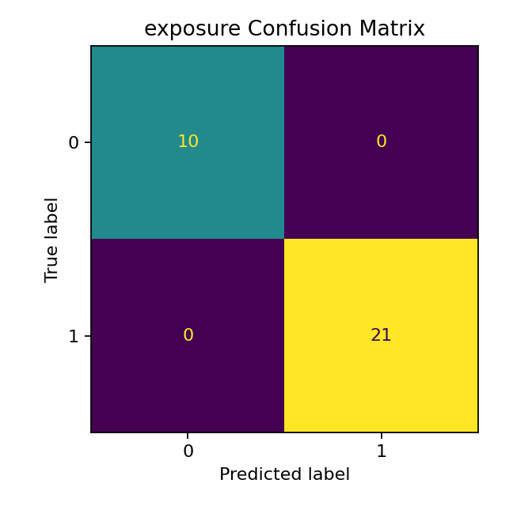
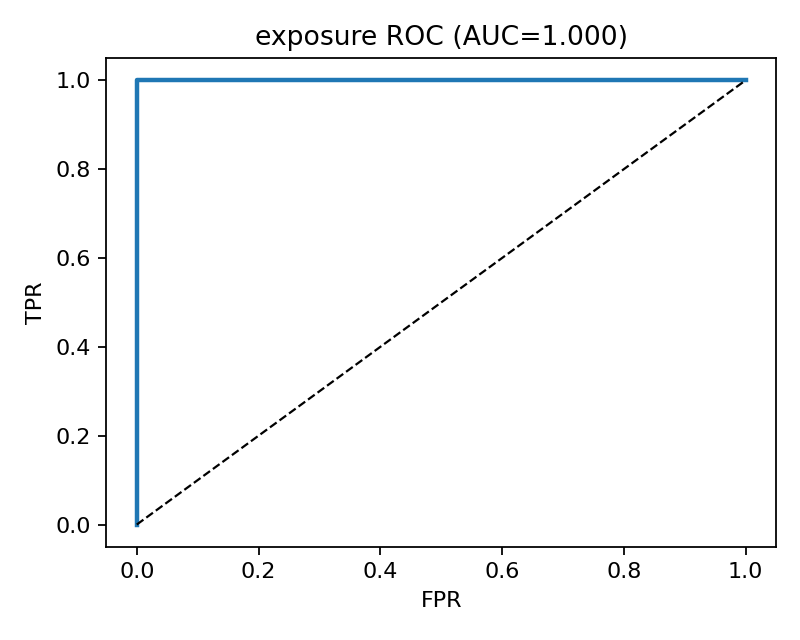
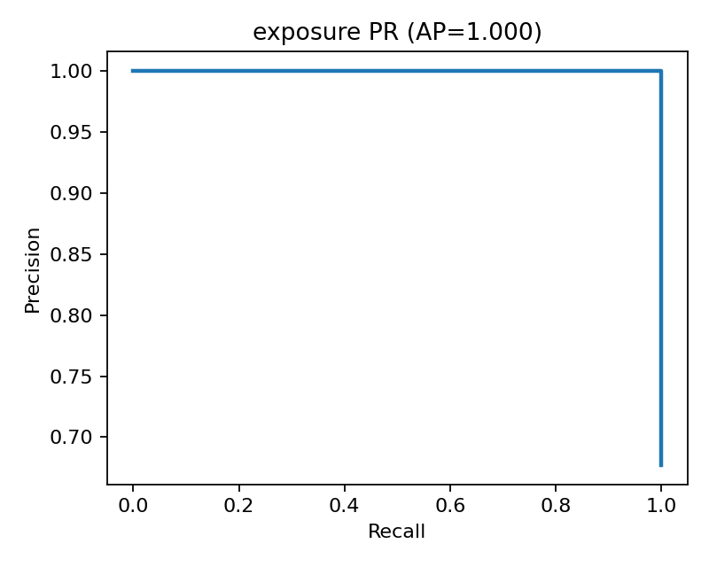
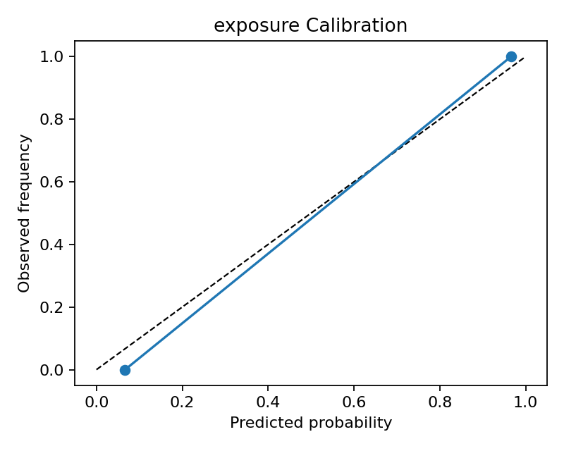
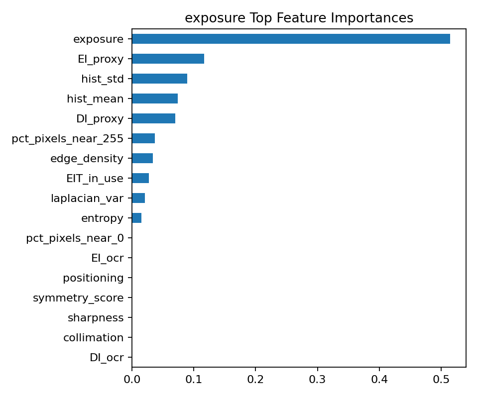
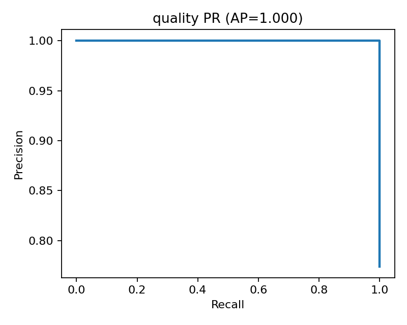
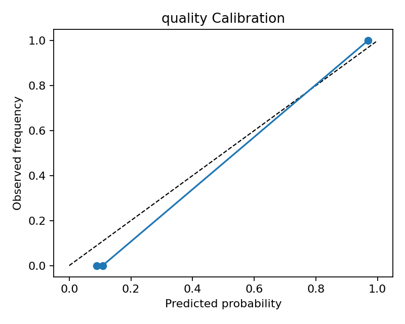
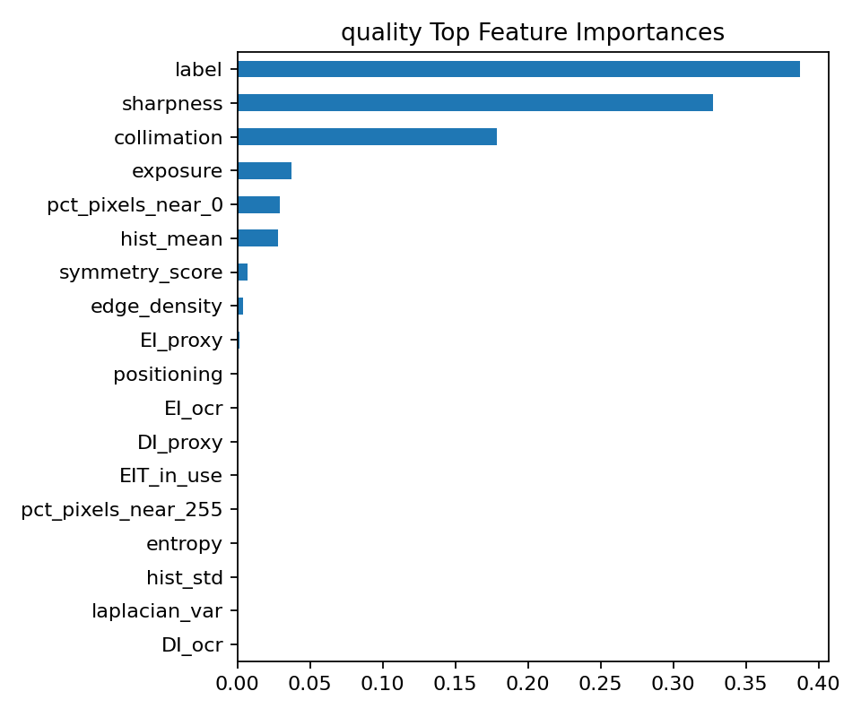

# Radiograph QC — Hold-out Evaluation
_Generated: 2025-10-08T18:37:20_

## Exposure Model
- Train/Test sizes: 121 / 31
- Test positive rate: 0.677
- AUC: **1.000**
- Average Precision: **1.000**
- Brier score: 0.0022

### Confusion Matrix


### ROC Curve


### Precision–Recall Curve


### Calibration Curve


### Top Feature Importances


### Classification Report
```
              precision    recall  f1-score   support

           0      1.000     1.000     1.000        10
           1      1.000     1.000     1.000        21

    accuracy                          1.000        31
   macro avg      1.000     1.000     1.000        31
weighted avg      1.000     1.000     1.000        31
```

## Quality Model
- Train/Test sizes: 121 / 31
- Test positive rate: 0.774
- AUC: **1.000**
- Average Precision: **1.000**
- Brier score: 0.0027

### Confusion Matrix


### ROC Curve


### Precision–Recall Curve


### Calibration Curve


### Top Feature Importances


### Classification Report
```
              precision    recall  f1-score   support

           0      1.000     1.000     1.000         7
           1      1.000     1.000     1.000        24

    accuracy                          1.000        31
   macro avg      1.000     1.000     1.000        31
weighted avg      1.000     1.000     1.000        31
```

